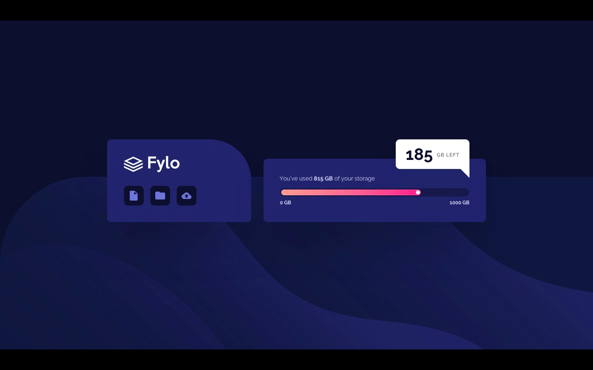
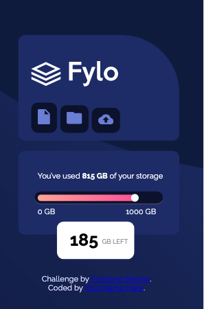

# Frontend Mentor - Fylo data storage component

Your challenge is to build out this data storage component and get it looking as close to the design as possible. 

*This is the original design for desktop*

*This is the original design for mobile*

## Where to find everything

In the `/images`folder you will find all the required assets for the project. The assets are already optimized.

There is also a `style-guide.md` file, which contains the information you'll need, such as color palette and fonts.

In the `index-html` you will find the HTML structure for this project and in the `styles.css` you will find all the styles for this challenge.

## Sharing your solution

If you want to see my project click the following link . The project was deploy with 

## My results
*This is my design for desktop*

*This is my design for mobile*

## Giving feedback

Feedback is always welcome! 

## Community Sponsors from Front End Mentor

A massive thank you to our community sponsors!

- [Sizzy](https://bit.ly/fm-sizzy) is an extremely useful browser designed specifically to improve a developer's workflow when building websites. You can fire up multiple device emulators and run them all in sync while building out your web pages. Perfect for helping build fully responsive websites!
- [Diversify Tech](https://bit.ly/fem-diversify-tech) is an amazing resource for underrepresented people in tech. The site features job listings for anyone seeking new opportunities. The resource section is also full of useful links for you to dive into.
- [Dracula PRO](https://bit.ly/fem-dracula) is a beautiful dark theme to help keep you focused and productive while you code. The theme isn't just for your editor either. You can also apply it to your most-used apps like your terminal and even Slack!
